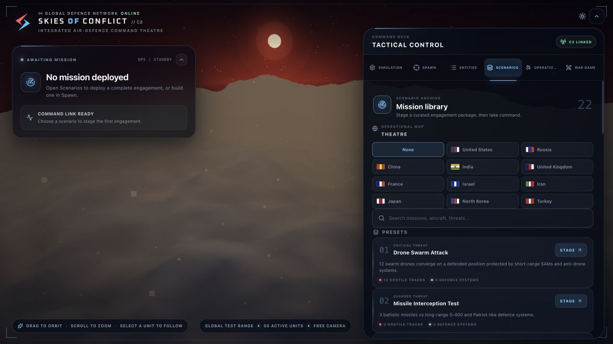
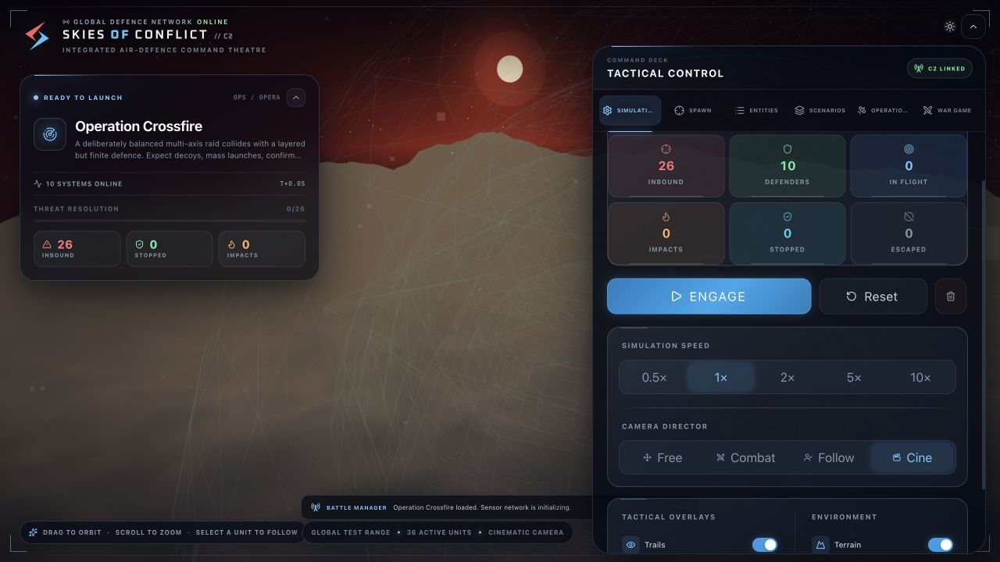
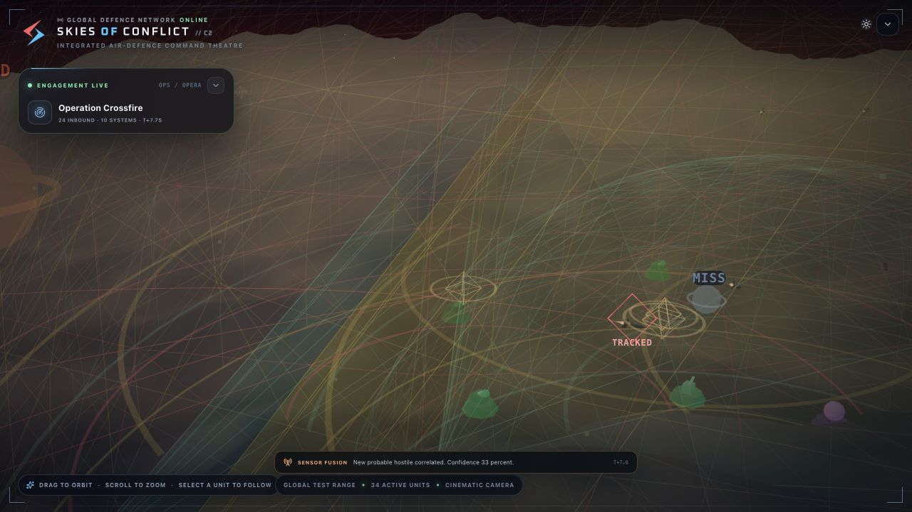
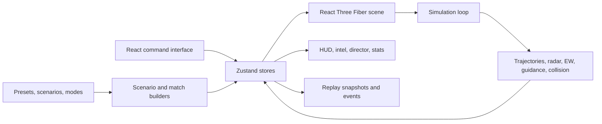

# SKIES OF CONFLICT

> A cinematic, browser-based air-warfare sandbox and asymmetric command game.


**SKIES OF CONFLICT** is a real-time 3D command theatre where players stage air attacks, build layered defences, plot tactical plans, change environmental conditions, run deterministic war games, and review cinematic after-action replays.

The project combines a sandbox simulator with structured modes such as hot-seat commander-versus-commander, survival, tactical puzzles, campaign operations, tournaments, daily challenges, and asynchronous plan sharing. It runs entirely in the browser and currently requires no backend or account.

> [!NOTE]
> The name shown in the product is **SKIES OF CONFLICT**. It is the polished form of the original “Sky of Conflicts” concept.

> [!IMPORTANT]
> This is a fictional strategy and visualization experience. Its ranges, probabilities, platform behavior, geography, and combat outcomes are deliberately stylized for gameplay; they are not an operational or engineering model of real-world weapon systems.

## Table of contents

- [Project status](#project-status)
- [What is included](#what-is-included)
- [Screenshots](#screenshots)
- [Quick start](#quick-start)
- [Available commands](#available-commands)
- [First mission walkthrough](#first-mission-walkthrough)
- [Command interface](#command-interface)
- [Game modes](#game-modes)
- [War Room flow](#war-room-flow)
- [Operations suite](#operations-suite)
- [Simulation systems](#simulation-systems)
- [Attack systems](#attack-systems)
- [Defence systems](#defence-systems)
- [Countries and theatres](#countries-and-theatres)
- [Scenarios and deterministic simulation](#scenarios-and-deterministic-simulation)
- [Sharing and local persistence](#sharing-and-local-persistence)
- [Architecture](#architecture)
- [Project structure](#project-structure)
- [Extending the project](#extending-the-project)
- [Quality checks](#quality-checks)
- [Production build and deployment](#production-build-and-deployment)
- [Moving the project without committing](#moving-the-project-without-committing)
- [Browser support and performance](#browser-support-and-performance)
- [Known limitations](#known-limitations)
- [Troubleshooting](#troubleshooting)
- [License](#license)

## Project status

| Area | Status | Notes |
|---|---|---|
| 3D simulation | Playable | Real-time movement, tracking, engagement, interception, impact, and replay |
| Sandbox tools | Playable | Spawning, parameter editing, scenarios, camera and time controls |
| War Room | Playable | Seven modes with constrained force selection and deterministic resolution |
| Operations suite | Playable | Tactical map, intelligence, weather, AI doctrine, career, local link, replay |
| Persistence | Local | Browser `localStorage`; no account or cloud synchronization |
| Multiplayer | Local prototype | Hot-seat play and same-browser-tab command link; no remote server |
| Automated tests | Not added | TypeScript build and ESLint are the current validation gates |
| Production optimization | Partial | Production build works; Vite reports a non-blocking large-chunk warning |

## What is included

### Cinematic 3D command theatre

- Procedural country terrain, coastlines, cities, landmarks, atmospheric lighting, clouds, rain, lightning, dust, stars, vignette, film grain, and command-HUD overlays.
- Distinct silhouettes for fighters, drones, missiles, bombs, launchers, guns, electronic-warfare units, and interceptors.
- Free, combat, follow, and cinematic camera modes.
- Flight trails, radar volumes, tactical sectors, patrol orbits, no-fly areas, explosions, lock indicators, and hit/miss feedback.
- Light and dark themes with a responsive, collapsible Tactical Control deck.

### Simulation sandbox

- 26 attack platform and munition types.
- 8 defence classes represented by 16 configured defence presets.
- 8 attack trajectory models and 6 interceptor guidance models.
- Radar detection, confidence-based identification, target prioritization, ammunition, reload cycles, reaction delays, jamming, decoys, subsystem damage, and layered engagement logic.
- Twenty-two built-in scenarios across eleven country theatres.
- Manual entity spawning and live parameter editing.
- Simulation speeds of `0.5x`, `1x`, `2x`, `5x`, and `10x`.

### Structured game experience

- Commander-versus-Commander hot-seat planning with hidden handoff phases.
- Survival, co-op, puzzle, persistent campaign, tournament, and asynchronous-plan modes.
- Constrained budgets, unit caps, doctrine choices, intelligence spending, objectives, and deterministic seeds.
- Five AI commander personalities with different tactical biases.
- Daily seeded challenge shared by every player for a given UTC date.
- Commander XP, rating, levels, medals, doctrine unlocks, campaign readiness, territory, intelligence, credits, and cumulative losses.
- Indexed combat replay with launch, interception, impact, and escape events.

## Screenshots

### Mission library

Browse the built-in operations by theatre, compare each mission's forces and conditions, or stage a custom engagement.



### Tactical Control

Stage Operation Crossfire with live force telemetry, simulation speed, camera direction, tactical overlays, and environmental controls.



### Operation Crossfire in action

Cinematic mode collapses the command panels automatically so launches, flight paths, radar coverage, interceptions, and impacts can fill the battlefield.



## Quick start

### Requirements

- [Node.js](https://nodejs.org/) `20.19+` or `22.12+`
- npm (included with Node.js)
- A modern browser with WebGL 2 support
- A GPU or integrated graphics processor with hardware acceleration enabled

The repository uses `package-lock.json`, so npm is the expected package manager.

### Install and run

```bash
git clone <repository-url>
cd skies-of-conflict
npm install
npm run dev
```

Open the URL printed by Vite. The default is usually:

```text
http://127.0.0.1:5173/
```

### Optional setup helper

```bash
chmod +x setup.sh
./setup.sh
```

Review the script before running it on a managed development machine.

## Available commands

| Command | Purpose |
|---|---|
| `npm run dev` | Start the Vite development server with hot reload |
| `npm run build` | Type-check and create an optimized build in `dist/` |
| `npm run lint` | Run ESLint across the codebase |
| `npm run preview` | Serve the production build for a final browser check |

There is currently no automated unit or end-to-end test command.

## First mission walkthrough

The fastest way to see the complete experience is:

1. Start the app and open **Scenarios** in the Tactical Control panel.
2. Select a country or load a mission such as **Delhi Integrated Air Shield**.
3. Open **Operations → World** and choose weather, time of day, and turbulence.
4. Open **Operations → Map** to plot a route, CAP orbit, defence sector, or no-fly zone.
5. Return to **Simulation** and select **Engage**.
6. Switch between **Combat**, **Follow**, and **Cine** cameras while the engagement resolves.
7. Open **Operations → Intel** to inspect confidence, classification, and jammed tracks.
8. After the engagement, open **Operations → Replay** to scrub recorded frames and jump to indexed events.

For competitive setup, open **War game**, choose **Commander vs Commander**, and follow the defender-handoff-attacker flow.

## Command interface

The Tactical Control deck contains six primary tabs.

| Tab | Purpose |
|---|---|
| **Simulation** | Start, pause, reset, clear, change speed/camera, record, and toggle layers |
| **Spawn** | Create individual attack or defence entities with a preset and trajectory |
| **Entities** | Inspect active entities and edit supported parameters |
| **Scenarios** | Load built-in missions, save custom missions, and share scenario packages |
| **Operations** | Use tactical planning, intelligence, environment, AI, career, link, and replay |
| **War game** | Configure and launch constrained game modes |

The whole command panel can be collapsed from its top control. Its labels, cards, segmented controls, and buttons use responsive spacing for narrower viewports.

### Simulation controls

| Control | Behavior |
|---|---|
| **Engage / Pause** | Starts or pauses the current engagement |
| **Reset** | Restores the loaded mission to its initial snapshot |
| **Clear** | Removes the current mission and all entities |
| **Record** | Starts or stops replay capture for sandbox engagements |
| **Time scale** | Changes speed without changing the scenario seed |
| **Camera director** | Selects Free, Combat, Follow, or Cine presentation |
| **Tactical overlays** | Toggles trails, radar cones, and dome grid |
| **Environment** | Toggles terrain and collision/hit-volume visualization |

### Mouse controls

| Action | Input |
|---|---|
| Orbit | Left-click and drag |
| Pan | Right-click and drag |
| Zoom | Mouse wheel or trackpad scroll |
| Follow a unit | Select a unit, then use Follow camera mode |

## Game modes

| Mode | Players | Core idea |
|---|---:|---|
| **Commander vs Commander** | 2 | Asymmetric hot-seat duel with secret defence and attack plans |
| **Last Light** | 1 | Survive escalating mixed-threat waves with limited magazines |
| **Joint Command** | 2 | Split radar, outer-layer, and terminal-defence responsibilities |
| **Tactical Problems** | 1 | Solve authored missions under equipment and doctrine constraints |
| **The Long War** | 1–2 | Carry readiness, losses, territory, intelligence, and credits between operations |
| **War Games** | 2 | Repeatable competitive rounds with fixed seeds and mirrored constraints |
| **Dead Drop** | 2 | Export a command plan for another player to resolve later |

### Authored operations

- **Survival:** First Watch, Black Sky, Last Light.
- **Co-op:** Joint Shield.
- **Puzzles:** Twelve Tracks, Four Launchers; The Silent Corridor; Decoy Calculus.
- **Glass Horizon:** Border Echo, Broken Spectrum, Capital Siege.
- **Midnight Lance:** Polar Watch, Line Breaker.
- **Ember Strait:** Strait Crossing, Carrier Shadow.

## War Room flow

Head-to-head modes use an explicit phase machine:

```text
Mode select
  → Mission briefing
  → Defender setup
  → Encrypted handoff
  → Attacker setup
  → Final authorization
  → Live battle
  → Debrief and score
```

Each side works within a budget and maximum unit count. The defender selects formation, radar posture, engagement priority, salvo policy, and reserve percentage. The attacker selects approach, formation, wave timing, altitude, and target priority. Optional intelligence packages consume attack budget.

Once both plans are locked, the scenario builder converts selections and doctrines into placement, timing, paths, parameters, and a deterministic seed. The same committed plan and seed are intended to produce a comparable engagement.

### Results and scoring

The debrief records:

- Winner and letter grade (`S` through `D`).
- Defender and attacker scores.
- Interceptions, impacts, and escaped threats.
- Interception rate and engagement duration.
- Interceptors fired and each side’s spend.

Campaign and tournament meta-progression is updated after a structured War Room result.

## Operations suite

### Map

The tactical map supports four planning tools:

- **Route:** A multi-point flight path.
- **CAP:** A combat-air-patrol orbit.
- **Sector:** A defence coverage zone.
- **No-fly:** A restricted airspace area.

Committed shapes are mirrored into the 3D scene. Plans can be shared as `SKYOPS1-…` text packages. These packages contain routes and zones only, not an entire mission or browser profile.

### Intel

Fog of war hides or obscures hostile entities until sensor confidence is established. Tracks progress through:

```text
unconfirmed → probable → classified → identified
```

The common operating picture displays confidence, last-seen time, estimated position, classification, and jamming state. Radio messages summarize important launches, kills, warnings, impacts, and system events.

### World

Environment controls affect both presentation and parts of sensor behavior.

| Setting | Options |
|---|---|
| Weather | Clear, overcast, storm front, monsoon, dust veil |
| Time | Dawn, day, dusk, night |
| Wind/turbulence | Continuous control from calm to severe |
| Cinematic director | Automatic emphasis on launches, near misses, and terminal interceptions |

Weather changes visibility, fog, precipitation, atmosphere, and detection conditions. It is a gameplay model, not a meteorological simulation.

### AI commanders

| Commander | Callsign | Bias |
|---|---|---|
| Astra | MIRROR | Adaptive, balanced target selection and timing |
| Viper | REDLINE | Aggressive reactions and ammunition expenditure |
| Nox | GHOST | Deception, decoys, feints, and irregular timing |
| Rook | ANVIL | Saturation and coordinated time-on-target |
| Shade | VEIL | Stealth, terrain masking, and later classification |

### Career and campaigns

The commander profile starts with callsign `SKYWARD`, rating `1000`, and the Sensor Fusion doctrine. Completing operations grants XP and changes rating.

| Doctrine | Unlock |
|---|---:|
| Sensor Fusion | Default |
| Rapid Response | 2 operations |
| Hardened Network | 4 operations |
| Terminal Focus | 7 operations |

Medals are awarded for achievements such as an `S` grade, a perfect interception rate, ten operations, or a multi-day challenge streak.

The career area exposes three persistent theatres:

- **Glass Horizon** — a near-future border crisis and capital siege.
- **Midnight Lance** — night interception and magazine discipline in a northern corridor.
- **Ember Strait** — a fictional maritime theatre involving coastal missiles and carrier aviation.

### Daily directive

The daily operation is derived from the current UTC date. Every player receives the same country rotation, force package, difficulty, and deterministic seed for that date. Progress is stored locally; there is no online leaderboard yet.

### Command Link

Command Link creates or joins a room with the browser `BroadcastChannel` API. It is useful for testing roles across multiple tabs on the same origin and browser profile.

It is **not** Internet multiplayer. Cross-device play will require an authoritative backend and WebSocket or WebRTC transport, plus authentication, validation, reconnection, and synchronization.

### Replay

War Room engagements record automatically. Sandbox engagements can be recorded manually. Replay capture stores position, velocity, status, and indexed events for attack, defence, and interceptor entities.

- A snapshot is captured every five render frames, approximately 12 snapshots per second at 60 FPS.
- The rolling buffer is capped at 3,600 snapshots.
- The replay view can play, stop, scrub, and jump to launches, hits, impacts, or escapes.
- Replay data is held in memory and is not preserved after a page reload.

## Simulation systems

### Entity lifecycle

```text
active → intercepted | destroyed | missed | exploded
```

The simulation loop advances movement, trajectories, radar tracks, target selection, guidance, collisions, damage, effects, statistics, radio events, and replay frames. Zustand stores keep state separate from React presentation components.

### Radar and tracking

Detection considers range, field of view, target signature/stealth, radar policy, jamming, and environmental degradation. Detected targets accumulate confidence. Defences prioritize and engage only within modeled constraints unless a mission-specific preset enables assured coverage.

### Engagement logic

Defensive systems consider:

- Maximum range and detection range.
- Reaction delay, cooldown, reload state, and ammunition.
- Maximum simultaneous tracked targets.
- Threat priority: time to impact, high value, or mass threat.
- Interceptor guidance law and kill radius.
- Decoy suspicion and electronic-warfare effects.
- Doctrine, reserve policy, and salvo behavior.

### Electronic warfare

Electronic attack can reduce effective sensor performance and complicate guidance. Focused jamming and spoofing utilities support EW aircraft and signal-jammer entities in the simulation loop.

### Damage model

Aircraft and defence systems can carry overall integrity plus five subsystems:

- Radar
- Propulsion
- Guidance
- Weapons
- Communications

Damage and near misses can reduce capability before an entity is destroyed. The model is intentionally lightweight and tuned for readable gameplay outcomes.

### Trajectory and guidance models

Attack trajectories:

| Model | Behavior |
|---|---|
| Straight | Direct constant-heading flight |
| Ballistic | Gravity-influenced arc |
| Cruise | Low-altitude terrain-following motion |
| Zigzag | Repeated evasive lateral movement |
| Waypoint | Navigation through configured points |
| Dive | Cruise followed by a terminal descent |
| Loitering | Orbit around a search or hold point |
| Swarm | Coordinated motion with local separation |

Defence guidance:

| Model | Behavior |
|---|---|
| Direct intercept | Points at the target’s current position |
| Predictive intercept | Leads using estimated future position |
| Proportional navigation | Turns against line-of-sight rate |
| Radar guided | Tracks through a radar-assisted solution |
| Heat seeking | Homes on a simplified infrared signature |
| Burst fire | Models short-range gun or CIWS engagement |

## Attack systems

The sandbox exposes 26 attack types. Many share a physics family but have different parameters, silhouettes, payloads, signatures, and default trajectories.

| Family | Included types |
|---|---|
| Rockets and missiles | Rocket, ballistic missile, cruise missile, hypersonic glide vehicle, anti-radiation missile, naval missile |
| Uncrewed systems | Recon drone, kamikaze drone, swarm drone, stealth drone, loitering munition |
| Aircraft | Fighter jet, stealth aircraft, bomber, EW aircraft |
| Guided and area weapons | Glide bomb, laser-guided bomb, GPS-guided bomb, cluster munition |
| Deception | Radar decoy |
| Named fighters | F-35, F-22, Su-30, Su-57, Rafale, J-35 |

Named fighters include simplified payloads for air-to-air missiles, air-to-ground missiles, and bombs. Payload capacity is represented for gameplay and is not meant to reproduce classified or real-world performance.

## Defence systems

The defence model has 8 classes and 16 presets.

| Class | Representative presets | Role |
|---|---|---|
| Long-range SAM | S-400, Indian S-400, Patriot | Wide-area outer layer |
| Medium-range SAM | NASAMS, Buk, Barak-8, Akash-NG | Main engagement layer |
| Short-range SAM | Iron Dome, QRSAM | Inner layer and high-capacity interception |
| CIWS | CIWS, AK-630 close-in shield | Terminal point defence |
| Anti-aircraft gun | Anti-Aircraft Gun | Low-cost close defence |
| Counter-drone gun | Anti-Drone Gun, DRDO C-UAS | Drone-focused hard/soft kill layer |
| Signal jammer | Signal Jammer | Guidance and sensor disruption |
| Laser defence | Laser Defence | Short-range directed-energy interception |

### Delhi integrated shield

**Delhi Integrated Air Shield** is intentionally configured as a powerful showcase defence. It combines Indian S-400, Barak-8, Akash-NG, QRSAM, DRDO counter-drone systems, and an AK-630 terminal shield.

Some mission-specific presets use `assuredDetection`, `assuredKill`, and a sealed terminal zone. Those flags create the requested “nothing escapes” power-fantasy scenario; they are not real-world capability claims or balanced competitive defaults.

The India identity uses the saffron, white, and green tricolour with a navy Ashoka Chakra treatment in the interface.

## Countries and theatres

Country selection changes terrain palette, biome, fog, coast treatment, cities, landmarks, and regional scenarios.

| Country | Theatre flavor | Notable locations |
|---|---|---|
| United States | Temperate plains and coastal operations | Washington, New York, Pearl Harbor |
| Russia | Cold steppe and snow-capped terrain | Moscow, St. Petersburg |
| China | Green hills and river valleys | Beijing, Shanghai, Shenzhen |
| India | Tropical lowlands, coast, and dry edges | New Delhi, Mumbai, Bangalore, Chennai |
| United Kingdom | Rolling terrain and coastline | London, Manchester, Edinburgh, Belfast |
| France | Temperate fields and urban corridors | Paris, Marseille |
| Israel | Arid terrain and compact defended areas | Tel Aviv, Jerusalem, Haifa |
| Iran | Desert and mountainous terrain | Tehran, Isfahan |
| Japan | Volcanic island terrain | Tokyo, Osaka, Hiroshima |
| North Korea | Cold mountainous terrain | Pyongyang |
| Turkey | Mediterranean coast and mountains | Istanbul, Ankara |

Geography is stylized onto a shared simulation coordinate system rather than mapped to real scale.

## Scenarios and deterministic simulation

The repository includes 22 sandbox scenarios ranging from simple drone swarms and missile interceptions to stealth, saturation, country defence, and multi-domain missions. **Operation Crossfire** is the balanced chaos showcase: a deterministic, multi-axis raid tuned to produce both interceptions and penetrations.

A `Scenario` contains:

- An ID, name, description, and optional deterministic seed.
- Attack entries with type, trajectory, position, velocity, delay, count, spacing, waypoints, decoy status, and parameter overrides.
- Defence entries with type, trajectory, position, facing, preset ID, and parameter overrides.

Structured modes generate scenarios from force selections and doctrines through `matchBuilder.ts`. Randomized decisions use the committed seed so equivalent inputs are reproducible within the current implementation.

## Sharing and local persistence

### Text package formats

| Prefix | Content | Created in |
|---|---|---|
| `SKYSCN1-` | Complete custom scenario package | Scenarios |
| `SKYOPS1-` | Tactical routes, patrols, sectors, and no-fly zones | Operations → Map |
| `SKY1-` | Asynchronous War Room command plan | War game → Dead Drop |

Packages are versioned, UTF-8-safe Base64 text envelopes. They are portable serialization, **not encryption**. Do not put secrets in them.

Importers validate the expected prefix and reject malformed packages. Future format changes should introduce a new prefix rather than silently changing version 1.

### Browser storage

| Storage key | Data | Persists after reload |
|---|---|---:|
| `skies-of-conflict-operations-v1` | Operations preferences, profile, doctrines, campaign selection | Yes |
| `skyshield-command-plans-v1` | Saved War Room plans | Yes |
| `skyshield-game-progress-v1` | Campaign and tournament progress | Yes |
| `skyshield-theme` | Light/dark theme | Yes |
| `air-warfare-saved-scenarios` | Saved custom sandbox scenarios | Yes |

The `skyshield-*` keys are retained deliberately for backward compatibility with earlier builds. Renaming them would make existing local progress appear lost. They are legacy storage identifiers, not current product branding.

Replay frames, current entities, tactical map drafts, wind strength, and Command Link room state are session memory and are lost on reload.

To reset all local progress, use in-app reset controls where available or clear site data for the local origin in browser developer tools.

## Architecture



### Runtime responsibilities

- **React** renders panels, overlays, workflows, and state-driven presentation.
- **React Three Fiber** connects React components to the Three.js scene graph.
- **Three.js** renders terrain, atmosphere, entities, effects, lights, and cameras.
- **Zustand** owns simulation, entity, scenario, replay, country, camera, game-mode, theme, and Operations state.
- **Simulation hooks** advance the world and coordinate spawners and replay.
- **Logic modules** isolate trajectories, radar, EW, collision, interception, and match generation.
- **Static data modules** define countries, scenarios, catalog items, presets, campaigns, AI commanders, and tooltips.

## Project structure

```text
skies-of-conflict/
├── public/
│   ├── favicon.svg
│   └── icons.svg
├── src/
│   ├── assets/
│   ├── components/
│   │   ├── entities/       # Entity meshes and engine bridge
│   │   ├── game/           # Structured-mode result controller
│   │   ├── scene/          # Scene, terrain, weather, camera, overlays
│   │   ├── ui/             # Command deck, Operations, War Room, editors
│   │   └── visuals/        # Trails, radar, explosions, locks, results
│   ├── data/               # Presets, countries, modes, operations, scenarios
│   ├── hooks/              # Spawning, simulation loop, replay playback
│   ├── logic/
│   │   ├── ai/             # Engagement, prioritization, decoy decisions
│   │   ├── ew/             # Jamming and spoofing
│   │   ├── game/           # Seeded random and match building
│   │   ├── intercept/      # Guidance and interception engine
│   │   ├── physics/        # Kinematics and collision
│   │   ├── radar/          # Detection and tracking
│   │   ├── terrain/        # Procedural noise
│   │   └── trajectories/   # Attack and defence motion
│   ├── store/              # Zustand state stores
│   ├── types/              # Entity, game, Operations, scenario types
│   ├── App.tsx
│   ├── index.css
│   └── main.tsx
├── eslint.config.js
├── index.html
├── package.json
├── setup.sh
├── tsconfig*.json
└── vite.config.ts
```

### High-value entry points

| File | Responsibility |
|---|---|
| `src/App.tsx` | Top-level scene, brand, command panel, status, and director |
| `src/components/scene/Scene.tsx` | Three.js canvas and scene systems |
| `src/hooks/useSimulationLoop.ts` | Main real-time simulation coordinator |
| `src/store/entityStore.ts` | Entity and interceptor state |
| `src/components/ui/ControlPanel.tsx` | Primary Tactical Control navigation |
| `src/components/ui/GameModePanel.tsx` | War Room workflows and launch actions |
| `src/components/ui/OperationsPanel.tsx` | Map, intel, world, AI, career, link, replay |
| `src/logic/game/matchBuilder.ts` | Converts plans and operations into scenarios |
| `src/data/scenarios.ts` | Built-in sandbox missions |
| `src/data/attackPresets.ts` | Attack platform defaults |
| `src/data/defencePresets.ts` | Defence system defaults |
| `src/index.css` | Design system, responsive layout, cinematic effects |

## Extending the project

### Add an attack type

1. Add the literal to `AttackType` in `src/types/entities.ts`.
2. Add a preset in `src/data/attackPresets.ts`.
3. Select an existing trajectory or create one under `src/logic/trajectories/attack/`.
4. Add or adapt its geometry in `src/components/entities/AttackMesh.tsx`.
5. If needed in constrained modes, add it to `ATTACK_CATALOG`.
6. Verify spawn, motion, tracking, collision, replay, and reset.

### Add a defence preset

1. Reuse or extend `DefenceType` in `src/types/entities.ts`.
2. Add the preset and parameters to `src/data/defencePresets.ts`.
3. Confirm its guidance exists under `src/logic/trajectories/defence/`.
4. Add distinct visual treatment to `DefenceMesh.tsx` if required.
5. Add a budgeted `DEFENCE_CATALOG` entry if it belongs in War Room.
6. Test range, FOV, reaction, cooldown, ammo, reload, and capacity at multiple speeds.

### Add a scenario

1. Add a unique `Scenario` to `src/data/scenarios.ts`.
2. Provide `simulationSeed` when repeatability matters.
3. Reference valid attack/defence types and, where needed, `presetId`.
4. Add the scenario ID to the appropriate country’s `scenarioIds`.
5. Validate reset and replay, especially with delays, counts, or waypoints.

### Add a campaign operation or AI commander

- Add authored operations to `MODE_OPERATIONS` in `src/data/gameModes.ts`.
- Add theatre metadata or AI definitions to `src/data/operations.ts`.
- Extend relevant unions in `src/types/game.ts` or `src/types/operations.ts`.
- Update match-building behavior if the doctrine needs more than parameter changes.
- Add persistence migration logic before changing stored profile or campaign shapes.

### Change a share format

Treat package prefixes as public version markers. Add a new encoder/decoder version, keep the old decoder when practical, validate imported structure, and document the migration here.

## Quality checks

Run both gates before handoff:

```bash
npm run lint
npm run build
```

Recommended manual smoke test:

1. Load a built-in scenario and run it to completion.
2. Reset it and confirm the initial state returns.
3. Spawn one attack and one defence entity manually.
4. Test every camera mode and simulation speed.
5. Enable fog of war and verify track confidence changes.
6. Plot and import a tactical package.
7. Launch a War Room operation and inspect the debrief.
8. Play and scrub the replay.
9. Reload and verify theme, profile, plans, and campaign progress.
10. Check desktop and narrow-width layouts.

The current codebase passes ESLint and the TypeScript/Vite production build. Vite may report that the main JavaScript chunk exceeds 500 kB; this is a performance warning, not a build failure.

## Production build and deployment

```bash
npm run build
npm run preview
```

The deployable output is `dist/`. The app is a client-side static site and can be served by Nginx, Apache, GitHub Pages, Netlify, Vercel, or an object-storage/CDN setup.

No server-side environment variables are currently required. If deploying below a subpath, configure Vite’s `base` option and verify asset URLs.

Recommended production improvements:

- Lazy-load Operations and War Room panels.
- Split Three.js-heavy code into dedicated chunks.
- Compress future textures and media.
- Add error boundaries and privacy-conscious telemetry.
- Add unit tests for deterministic logic and browser tests for mission flows.
- Add a backend only when remote multiplayer, cloud profiles, or leaderboards are needed.

## Moving the project without committing

You can transfer the working tree, including uncommitted changes, without creating a commit or using the Git identity configured on this computer.

From the repository root:

```bash
tar \
  --exclude='./.git' \
  --exclude='./node_modules' \
  --exclude='./dist' \
  -czf ../skies-of-conflict-transfer.tar.gz .
```

Copy `../skies-of-conflict-transfer.tar.gz` to the other system, then:

```bash
mkdir skies-of-conflict
tar -xzf skies-of-conflict-transfer.tar.gz -C skies-of-conflict
cd skies-of-conflict
npm install
npm run build
```

The archive omits Git history and generated dependencies while preserving modified and untracked project files inside the repository.

If you also need existing Git history without committing here:

```bash
git bundle create ../skies-of-conflict-history.bundle --all
```

Clone that bundle on the destination and overlay the extracted working-tree files. A future commit will use the identity configured on the destination system.

## Browser support and performance

Recommended browsers:

- Current Chrome or Chromium.
- Current Firefox.
- Current Safari on a WebGL 2-capable Mac.

The app depends on WebGL 2, `BroadcastChannel`, `crypto.randomUUID`, `localStorage`, modern JavaScript, and browser animation APIs.

Performance is most affected by entity count, trails, radar geometry, weather particles, effects, and display resolution. For smoother play:

- Disable trails and radar cones for large swarms.
- Avoid maximum entity counts at `10x` on low-power devices.
- Keep hardware acceleration enabled.
- Close other GPU-heavy tabs.
- Use the production build when measuring performance.

## Known limitations

- The simulation is stylized and not validated against real-world flight, radar, or weapon data.
- Command Link is limited to tabs/windows on the same browser origin and profile.
- Hot-seat and co-op do not yet provide secure hidden information across devices.
- Replay data is memory-only and cannot yet be exported.
- Tactical and scenario packages are encoded, not encrypted or signed.
- There is no cloud save, leaderboard, authentication, matchmaking, moderation, or anti-cheat.
- The primary JavaScript bundle would benefit from code splitting.
- Automated unit, integration, accessibility, and end-to-end tests are not yet present.
- Keyboard navigation, focus management, reduced motion, screen-reader flow, and contrast need a dedicated audit.
- Country geography and equipment associations are fictionalized for presentation.

## Troubleshooting

### Node or Vite reports unsupported API errors

```bash
node --version
```

Use Node `20.19+` or `22.12+`. Older releases can fail while loading current Vite or ESLint dependencies.

### The default port is already in use

```bash
npm run dev -- --port 3000
```

### The scene is blank or WebGL initialization fails

- Verify WebGL 2 at [get.webgl.org](https://get.webgl.org/).
- Enable browser hardware acceleration.
- Update the OS, browser, and graphics drivers.
- Disable extensions that block canvas/WebGL.
- Check the browser console for shader, context, or asset errors.

### Frame rate is low

- Turn off trails, radar cones, and collision volumes.
- Select clear weather.
- Reduce active entities.
- Return the simulation to `1x`.
- Compare with `npm run build && npm run preview`.

### A select menu appears blank

Native menu rendering varies by operating system. Confirm the browser is current and no extension or forced-color mode overrides option colors. When editing the UI, preserve explicit foreground and background colors for both `select` and `option`.

### Saved plans or career progress seem stale

Browser state is origin-specific. `localhost:5173` and `127.0.0.1:5173` use separate storage. Use the same origin or clear the relevant site data.

### A shared package will not import

- Confirm the full prefix is present.
- Remove whitespace added by a messaging app.
- Paste into the matching importer.
- Remember that `SKYSCN1-`, `SKYOPS1-`, and `SKY1-` are different formats.

### Command Link peers do not appear

- Open both clients under the exact same origin and browser profile.
- Use the same room code.
- Confirm `BroadcastChannel` support.
- Do not expect the room to connect across computers or browsers.

### The build fails after dependency changes

```bash
rm -rf node_modules
npm install
npm run lint
npm run build
```

Do not delete `package-lock.json` unless you intentionally want npm to resolve a new dependency graph.

## License

No standalone `LICENSE` file is included. Until the owner selects and adds a license, treat the source as all rights reserved and do not assume it is open source.

---

Built as a cinematic strategy prototype with React, TypeScript, Three.js, React Three Fiber, Tailwind CSS, and Zustand.
